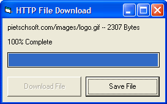



## HTTP File Download using Winsock

### Description

This is an example of how to use the Winsock control to download a file from an Web Server(HTTP Server). It is real simple to do, but it took me a few hours to figure out. I hope everyone likes it. I decided to do this, because I haven't seen much like it on Planet Source Code. I've updated it, fixing a couple bugs.
 
### More Info
 

             |
---                |---
**Submitted On**   |2003-03-20 15:02:00
**By**             |[Chris Pietschmann](https://github.com/Planet-Source-Code/PSCIndex/blob/master/ByAuthor/chris-pietschmann.md)
**Level**          |Intermediate
**User Rating**    |3.5 (14 globes from 4 users)
**Compatibility**  |VB 6\.0
**Category**       |[Files/ File Controls/ Input/ Output](https://github.com/Planet-Source-Code/PSCIndex/blob/master/ByCategory/files-file-controls-input-output__1-3.md)
**World**          |[Visual Basic](https://github.com/Planet-Source-Code/PSCIndex/blob/master/ByWorld/visual-basic.md)
**Archive File**   |[HTTP\_File\_1562253202003\.zip](https://github.com/Planet-Source-Code/chris-pietschmann-http-file-download-using-winsock__1-44131/archive/master.zip)

